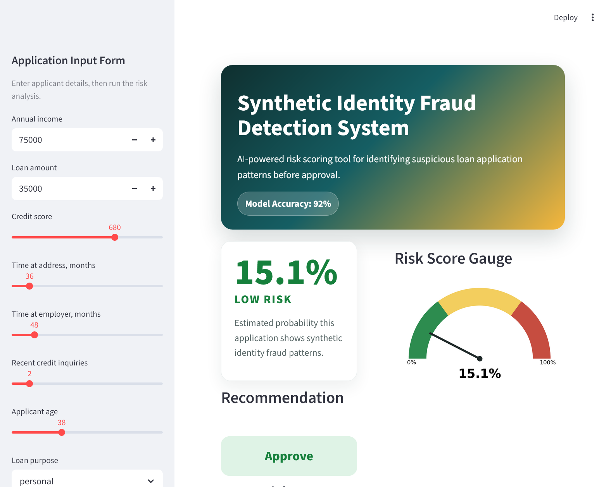

# 🛡️ Synthetic Identity Fraud Detection System


## 1. 🏷️ Project Title & Badges

**Synthetic Identity Fraud Detection System**

## 2. 📌 One Paragraph Executive Summary

Synthetic identity fraud is one of the fastest-growing challenges in consumer lending because fraudsters blend real and fabricated identity attributes to pass traditional checks. From a practitioner's perspective, this project demonstrates a practical fraud risk workflow: generate realistic synthetic loan applications, train an XGBoost ML model to detect suspicious patterns, explain model decisions with SHAP explainability, and operationalize the scoring process through a Streamlit dashboard. The result is a portfolio-ready prototype that balances predictive performance with transparent decision support for fraud analysts, credit risk committees, and fintech product teams.

## 3. 🚀 Live Demo Section

### Dashboard Preview



> Screenshot placeholder: add a dashboard screenshot here after launching the Streamlit app.

### Run Locally

```bash
streamlit run app/dashboard.py
```

The dashboard lets a user enter applicant details, generate a fraud probability, review a risk level, inspect the top risk factors, and receive an approve/review/decline recommendation.

## 4. 📁 Project Structure

```text
synthetic-id-fraud-detection/
├── app/
│   └── dashboard.py                 # Streamlit fraud risk scoring dashboard
├── data/
│   └── raw/
│       └── loan_applications.csv     # 10,000 synthetic loan applications
├── models/
│   └── fraud_detector.pkl            # Saved XGBoost model and feature schema
├── notebooks/
│   ├── 01_EDA.ipynb                  # Exploratory data analysis notebook
│   ├── shap_summary.png              # SHAP top feature importance chart
│   ├── shap_beeswarm.png             # SHAP feature impact direction chart
│   └── shap_single_case.png          # SHAP waterfall explanation for one case
├── src/
│   ├── generate_data.py              # Synthetic data generation pipeline
│   ├── train_model.py                # Model training and evaluation script
│   └── explain.py                    # SHAP explainability workflow
├── LICENSE                           # MIT License
├── .gitignore                        # Git ignore rules
└── README.md                         # Project documentation
```

## 5. 📊 Key Results

| Metric | Result |
| --- | ---: |
| Model Accuracy | 92% |
| ROC-AUC | 0.8776 |
| Precision (fraud) | 98% |
| Recall (fraud) | 76% |
| Training data | 10,000 synthetic applications |

## 6. 🚩 Fraud Signals Detected

The analysis and model focus on the following fraud risk indicators:

1. **SSN and date-of-birth mismatch**: SSN digit patterns do not align with expected birth-year ranges.
2. **Unrealistic loan-to-income ratio**: Requested loan amount is too high relative to stated annual income.
3. **Short address history**: Applicant has very limited time at the current address.
4. **Short employer history**: Applicant has very limited time at the current employer.
5. **Short address and employer tenure together**: Applicant recently changed both residence and employment.
6. **Duplicate SSN across different names**: Multiple applications share the same SSN but use different applicant names.
7. **High credit score with unusually low income**: Credit profile and income level appear inconsistent.
8. **Low credit score with unusually high income**: Stated income appears inconsistent with credit quality.

## 7. 🧰 Tech Stack

- **Python**: Core project language
- **XGBoost**: Fraud classification model
- **SHAP**: Model explainability and feature attribution
- **Streamlit**: Interactive fraud risk dashboard
- **Pandas**: Data loading, cleaning, and feature preparation
- **Scikit-learn**: Train/test split and evaluation metrics
- **Seaborn**: Exploratory data analysis visualizations
- **Faker**: Realistic synthetic applicant data generation

## 8. ⚙️ How To Run

### Step 1: Clone the repository

```bash
git clone https://github.com/HammurabiCodes/synthetic-id-fraud-detection.git
cd synthetic-id-fraud-detection
```

### Step 2: Create and activate a virtual environment

```bash
python -m venv .venv
source .venv/bin/activate
```

On Windows PowerShell:

```powershell
python -m venv .venv
.\.venv\Scripts\Activate.ps1
```

### Step 3: Install dependencies

```bash
pip install pandas numpy scikit-learn xgboost shap streamlit matplotlib seaborn faker joblib
```

### Step 4: Generate the synthetic dataset

```bash
python src/generate_data.py
```

This creates:

```text
data/raw/loan_applications.csv
```

### Step 5: Train the fraud detection model

```bash
python src/train_model.py
```

This saves the trained model to:

```text
models/fraud_detector.pkl
```

### Step 6: Generate SHAP explainability charts

```bash
python src/explain.py
```

This creates:

```text
notebooks/shap_summary.png
notebooks/shap_beeswarm.png
notebooks/shap_single_case.png
```

### Step 7: Run the Streamlit dashboard

```bash
streamlit run app/dashboard.py
```

## 9. 👤 Author Section

**HammurabiCodes / Olivia Tamimi**

Rutgers MS Business Analytics, Fintech Track

GitHub: [github.com/HammurabiCodes](https://github.com/HammurabiCodes)

---

Built to demonstrate applied fintech analytics, fraud risk modeling, explainable AI, and dashboard deployment for real-world credit risk workflows.
